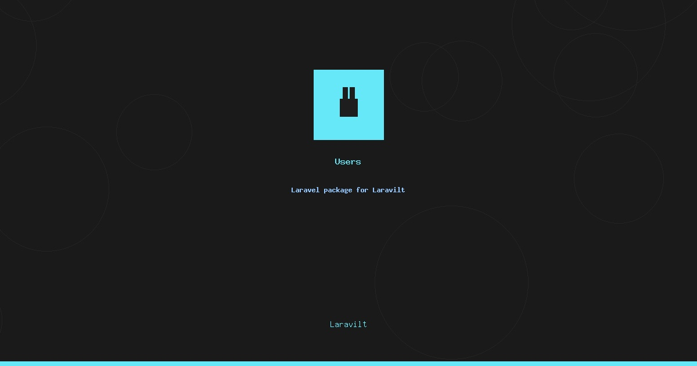

# Laravilt Users

[](https://packagist.org/packages/laravilt/users)
[](https://packagist.org/packages/laravilt/users)
[](https://packagist.org/packages/laravilt/users)
[](https://github.com/laravilt/users/actions/workflows/dependabot/dependabot-updates)
[](https://github.com/laravilt/users/actions/workflows/fix-php-code-styling.yml)
[](https://github.com/laravilt/users/actions/workflows/tests.yml)

Complete User and Role management plugin for Laravilt with full RBAC (Role-Based Access Control) system and impersonation support.

## Features

### User Management
- **Full CRUD Operations** - Create, read, update, and delete users
- **Avatar Support** - Optional user avatars with fallback to UI Avatars
- **Email Verification** - Track email verification status
- **Role Assignment** - Assign multiple roles to users
- **Search & Filters** - Filter users by role, search by name/email

### Role Management
- **Complete RBAC** - Full Role-Based Access Control system
- **Permission Groups** - Permissions grouped by resource
- **Bulk Selection** - Select all permissions for a resource
- **Guard Support** - Multiple auth guards support

### Impersonation
- **User Impersonation** - Login as any user for debugging/support
- **Session Preservation** - Original session saved during impersonation
- **Banner Notification** - Visual indicator when impersonating
- **Security Controls** - Cannot impersonate self or super admins

### Localization
- **Multi-language** - Full English and Arabic translations
- **RTL Support** - Right-to-left layout support for Arabic
- **Translatable Labels** - All fields, actions, and messages translated

## Requirements

- PHP 8.3+
- Laravel 12+
- Laravilt 1.0+
- Spatie Laravel Permission 6.0+

## Installation

```bash
composer require laravilt/users
```

The service provider is auto-discovered and will register automatically.

### Run Migrations

```bash
php artisan migrate
```

### Install Plugin

```bash
php artisan laravilt:users:install
```

This command will:
- Publish configuration file
- Set up default permissions
- Create default roles (Super Admin, Admin, User)

## Configuration

Publish the configuration file:

```bash
php artisan vendor:publish --tag=laravilt-users-config
```

Configure in `config/laravilt-users.php`:

```php
return [
    // Default guard for permissions
    'guard_name' => 'web',

    // Features (opt-in)
    'features' => [
        'impersonation' => false,  // Enable user impersonation
        'avatar' => false,         // Enable user avatars
        'teams' => false,          // Enable team support
        'email_verification' => true,
    ],

    // Navigation settings
    'navigation' => [
        'group' => 'Users & Roles',
        'sort' => 1,
    ],

    // Impersonation settings
    'impersonation' => [
        'redirect_to' => '/admin',
        'leave_redirect_to' => '/admin',
    ],
];
```

## Usage

### Register Plugin with Panel

```php
use Laravilt\Users\UsersPlugin;

class AdminPanelProvider extends PanelProvider
{
    public function panel(Panel $panel): Panel
    {
        return $panel
            ->plugins([
                UsersPlugin::make()
                    ->navigationGroup('Settings')
                    ->navigationSort(10)
                    ->avatar()           // Enable avatars
                    ->impersonation(),   // Enable impersonation
            ]);
    }
}
```

### Plugin Methods

```php
UsersPlugin::make()
    // Navigation
    ->navigationGroup('Custom Group')  // Set navigation group
    ->navigationSort(5)                // Set navigation order

    // Features (opt-in)
    ->avatar()                         // Enable avatar feature
    ->impersonation()                  // Enable impersonation feature
```

### User Model Setup

Add the required traits to your User model:

```php
use Laravilt\Users\Concerns\HasRolesAndPermissions;
use Laravilt\Users\Concerns\HasAvatar;

class User extends Authenticatable
{
    use HasRolesAndPermissions;
    use HasAvatar;  // Optional, for avatar support

    // For impersonation support
    public function canImpersonate(): bool
    {
        return $this->hasRole('super_admin');
    }

    public function canBeImpersonated(): bool
    {
        return !$this->hasRole('super_admin');
    }
}
```

### Setting Up Permissions

Run the setup command to create permissions for all resources:

```bash
php artisan laravilt:users:setup-permissions
```

This creates permissions like:
- `view_any_user`, `view_user`, `create_user`, `update_user`, `delete_user`
- `view_any_role`, `view_role`, `create_role`, `update_role`, `delete_role`

## Impersonation

### Enable Impersonation

```php
UsersPlugin::make()->impersonation()
```

### Add Middleware

Add the impersonation banner middleware to your panel:

```php
use Laravilt\Users\Http\Middleware\ImpersonationBanner;

$panel->middleware([
    ImpersonationBanner::class,
]);
```

### Stop Impersonation

Users can stop impersonation via:
- The banner "Stop Impersonation" button
- Route: `GET /admin/impersonation/leave`

## Resources

### UserResource

Manages users with:
- Avatar (optional)
- Name and Email
- Password management
- Role assignment
- Email verification status
- Created/Updated timestamps

### RoleResource

Manages roles with:
- Role name
- Guard name
- Permission assignment (grouped by resource)
- User count

## Translations

All strings are translatable. Translation files are located in:
- `lang/en/users.php` - English translations
- `lang/ar/users.php` - Arabic translations

## Documentation

Comprehensive documentation is available in the `docs/` directory:

- [Installation](docs/installation.md)
- [Configuration](docs/configuration.md)
- [Users Resource](docs/users.md)
- [Roles Resource](docs/roles.md)
- [Permissions](docs/permissions.md)
- [Impersonation](docs/impersonation.md)

## Testing

```bash
composer test
```

## Code Style

```bash
composer format
```

## Static Analysis

```bash
composer analyse
```

## Contributing

Please see [CONTRIBUTING.md](.github/CONTRIBUTING.md) for details.

## Security

If you discover any security-related issues, please email info@3x1.io instead of using the issue tracker.

## Changelog

Please see [CHANGELOG.md](CHANGELOG.md) for recent changes.

## License

The MIT License (MIT). Please see [License File](LICENSE.md) for more information.

## Credits

- [Fady Mondy](https://github.com/fadymondy)
- [Spatie](https://github.com/spatie) for Laravel Permission
- [All Contributors](../../contributors)

## Sponsors

Support this project via [GitHub Sponsors](https://github.com/sponsors/fadymondy).
